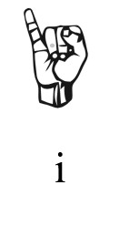
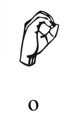

# "Languages1" Write-up (LITCTF 2025)
### Category: Misc
Provided: A video, and 3 Hints

1. **Watching the video and checking for hints**
	The video that was provided with the challenge of someone fingerspelling something in ASL. We also were provided 3 hints.
	- ASL
    - The flag can not numbers
    - **0** (first sign) does not appear in the flag

2. **Translating Fingerspelling**

The handsigns  appear flipped as the reference I obtained was for the right hand, and the video uses their left (or the video is mirrored). 

The 1st character is **L**.

The 2nd character is **I**.

The 3rd character is **T**.

The 4th character is **C**.

The 5th character is **T**.

The 6th character is **F**. The fingerspelling for F can have two different forms (some members of the hard-of-hearing community are picking about this.), but this is due to natural variations. Choose whatever is more comfortable for you.

What we have so far **LITCTF**. Implying that this message is in standard flag format, I'm gonna add the **{** after for **LITCTF{**. I will now continue.

The 7th character is **A**.

The 8th character is **S**.

 

The 9th character is **L**. Be wary that you do not miss **ASL**, this part goes quickly.

The 10th character is **C**.

The 11th and 12th characters are **oo**.

The 13th character is **L**.

There is no second L here!

The 14th character is **4**. Just like F, there can be variations in how people sign numbers in ASL, interchaning palm facing inwards and outwards.

The 15th character is **N**.

The 16th character is **G**. (It may appear different from the reference, but it is correct. "Palm in" refers to having the inside of your hand facing towards you.)

The 17th character is **U**.

The 18th character is **A**.

The 19th character is **G**.

The 20th character is **3**.

The 21st, 22nd, and 23rd characters are **sss**. (These were in quick succession.)

And then the video ends.

3. Putting It All Together

After translating all the fingerspelling and formatting into standard flag format, you end up with `**LITCTF{ASLCOOL4NGUAG3SSS}**`. Challenge complete!!

4. Feedback

I was pleasantly suprised to find a CTF Competition that included ASL in one of their challenges! I was a little confused about why it was `COOL4NGU...` and not `COOLL4NGU...`, but apart from that it was a fun little challenge.

_Author: InAudix_
_Credit to [Wikimedia](https://commons.wikimedia.org/wiki/File:Asl_alphabet_gallaudet_ann.svg) for the ASL alphabet refernce sheet_
